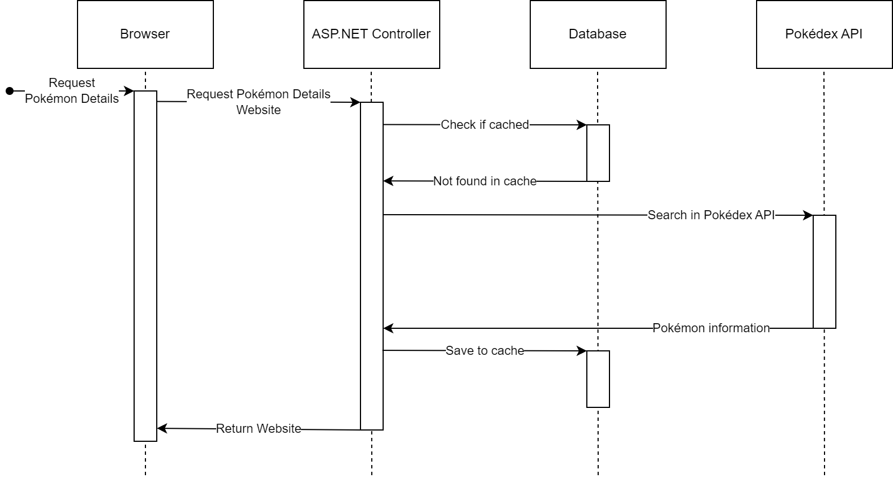
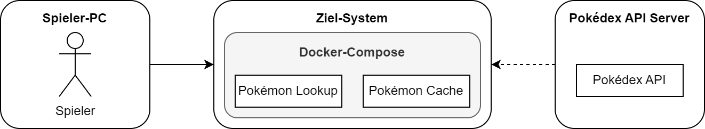

# SQS-Vorlesung

[](https://sonarcloud.io/summary/new_code?id=laternenpolster_sqs-vorlesung)
[](https://sonarcloud.io/summary/new_code?id=laternenpolster_sqs-vorlesung)
[](https://sonarcloud.io/summary/new_code?id=laternenpolster_sqs-vorlesung)
[](https://sonarcloud.io/summary/new_code?id=laternenpolster_sqs-vorlesung)

**Über arc42**

arc42, das Template zur Dokumentation von Software- und
Systemarchitekturen.

Template Version 8.2 DE. (basiert auf AsciiDoc Version), Januar 2023

Created, maintained and © by Dr. Peter Hruschka, Dr. Gernot Starke and
contributors. Siehe <https://arc42.org>.

<div class="note">

Diese Version des Templates enthält Hilfen und Erläuterungen. Sie dient
der Einarbeitung in arc42 sowie dem Verständnis der Konzepte. Für die
Dokumentation eigener System verwenden Sie besser die *plain* Version.

</div>

# Einführung und Ziele

Bei der hier beschriebenen Software handelt es sich um eine ASP.NET Web-App, mit der Informationen zu beliebigen Pokémons abgerufen werden können. Die App wird von einer Gruppe an Pokémon-Spielern eingesetzt, diese besteht aus 30 Leuten. Die Spieler erwarten sich durch die App, ergänzend zum Spiel Informationen zu Pokémons einsehen zu können.

Die Informationen werden von einer externen Pokédex REST-API abgerufen und in einer PostgreSQL Datenbank gespeichert, wodurch die Anfragen auf die API reduziert werden sollen. Diese Komponenten werden in der Zukunft möglicherweise durch andere Anbieter ausgetauscht. Aus diesem Grund soll die Architektur der App dafür ausgelegt sein, dass einzelne Module möglichst leicht ausgetauscht werden können. Als Grundlage dient hierfür die "Clean Architecture" von Jason Taylor.

Das Ziel der Software ist darüber hinaus nicht, eine komplexe neue App zu entwickeln, sondern die Software-Qualität möglichst gut abzusichern.

## Aufgabenstellung

| Use-Case                | Beschreibung                                                                                                                                                                                                                                                                    | Stakeholder |
| ----------------------- | ------------------------------------------------------------------------------------------------------------------------------------------------------------------------------------------------------------------------------------------------------------------------------- | ----------- |
| 1. Abrufen über Website | Informationen zu einem bestimmten Pokémon sollen über die Website abgerufen werden. Dabei sucht der Spieler das Pokémon anhand seines Namens, den er auf der Startseite der Web-App eingibt. Existiert kein Pokémon mit diesem Namen, soll eine Fehlermeldung angezeigt werden. | Spieler     |
| 2. Abrufen über API     | Informationen zu Pokémons können darüber hinaus auch durch eine integrierte REST-API abgerufen werden. Diese sucht ein Pokémon anhand seines Namens und liefert das Ergebnis als JSON kodiert zurück.                                                                           | Spieler     |

## Qualitätsziele

| Prio | Qualitätskriterium  | Ziele                                                                                                                                                                                                                                    | Maßnahmen                                                                                                                                                                                                                                                                                                                                                                                                                                                                                                                                                                                                                                                                                                                                                       |
| ---- | ------------------- | ---------------------------------------------------------------------------------------------------------------------------------------------------------------------------------------------------------------------------------------- | --------------------------------------------------------------------------------------------------------------------------------------------------------------------------------------------------------------------------------------------------------------------------------------------------------------------------------------------------------------------------------------------------------------------------------------------------------------------------------------------------------------------------------------------------------------------------------------------------------------------------------------------------------------------------------------------------------------------------------------------------------------- |
| 1    | Wartbarkeit         | - Einfache Weiterentwicklung des Projekts<br>- Hohe Verständlichkeit und Qualität des Codes<br>- Komponenten wie Datenbank oder API müssen zentral ausgetauscht werden können.<br>- Nur 1 Programmiersprache für alle Tests, keine DSLs. | - Projektstruktur mit 9 Projekten nach [Clean Architecture](https://jasontaylor.dev/clean-architecture-getting-started/) von Jason Taylor.<br>- Zyklische Abhängigkeiten werden bereits durch den Compiler erkannt.<br>- Alle Tests werden durch C# Projekte umgesetzt. Entwickler müssen somit keine DSLs für verschiedene Tests beherrschen.<br>- Code Style und Conventions werden durch die Pipeline geprüft. Bereits bei einem einzigen Verstoß oder Warnung schlägt die Pipeline fehl.<br>- Architektur Regeln werden durch ArchUnit Tests geprüft.<br>- Code Qualität wird mit SonarCloud überprüft.<br>- Gesamter Code (inklusive Tests) ist mit Kommentaren versehen.<br>- Dependency Injection in Kombination mit Interfaces für erhöhte Modularität. |
| 2    | Funktionale Eignung | - Die App muss die Bedürfnisse / Anforderungen der Benutzer erfüllen.                                                                                                                                                                    | - Projekt wird auf mehreren Ebenen funktional getestet: Unit Tests, Integration Tests, E2E Tests. Letztere testen speziell zuvor definierte Use-Cases.<br>- Erreichte Coverage: 100%                                                                                                                                                                                                                                                                                                                                                                                                                                                                                                                                                                            |
| 3    | Reliability         | - Die App soll auch bei deutlich höherer Last (500 statt 30 parallelen Anfragen) jede Anfrage ohne Fehler beantworten.                                                                                                                   | - Last Tests mit NBomber<br>- SonarCloud mit 0 Reliability Warnungen                                                                                                                                                                                                                                                                                                                                                                                                                                                                                                                                                                                                                                                                                            |
| 4    | Security            | - Der Code soll keine bekannten Sicherheitslücken aufweisen und neue automatisch erkennen.                                                                                                                                               | - Aqasecurity Trivy Vulnerability Scanner in GitHub Action<br>- CodeQL Scanner für C# und JS/TS<br>- SonarCloud mit 0 offenen Security Warnungen<br>- Regelmäßige Ausführung der Security-Pipelines, auch ohne Änderungen am Repo                                                                                                                                                                                                                                                                                                                                                                                                                                                                                                                               |
| 5    | Usability           | - Die Funktionalität der UI soll automatisiert sichergestellt werden.<br>- Pokémons im Cache müssen innerhalb von 30ms aufgerufen werden können.                                                                                         | - Frontend Tests mit Playwright (E2E Tests)<br>- Schnelle durchschnittliche Ladezeiten für Pokémons im Cache (< 30ms) durch Last Tests sichergestellt, auch bei 500 parallelen Anfragen.                                                                                                                                                                                                                                                                                                                                                                                                                                                                                                                                                                        |

## Stakeholder

| Rolle         | Kontakt    | Erwartungshaltung                                                             |
| ------------- | ---------- | ----------------------------------------------------------------------------- |
| Spieler       | -          | Zuverlässiges Abrufen von Pokémon Informationen                               |
| Entwickler    | -          | Gute Dokumentation, gute Projektstruktur, hohe Code Qualität                  |
| API-Betreiber | pokeapi.co | Keine Überlastung der API durch viele Anfragen                                |
| Dozent        | -          | Vollständige Dokumentation des Projekts, Verifizierung der Qualitätskriterien |

# Randbedingungen

Die folgenden Anforderungen wurden mündlich im Rahmen der Vorlesung "Software Qualitätssicherung" festgelegt:

| Name            | Beschreibung                                                         |
| --------------- | -------------------------------------------------------------------- |
| Frontend        | Die App muss sowohl ein Web-Frontend als auch eine REST-API anbieten |
| Kontext         | Eine Datenbank und eine externe REST-API müssen angebunden werden    |
| Tests           | Mindestens müssen Unit- und Integration Tests vorhanden sein         |
| GitHub          | Code und Doku müssen vollständig auf GitHub abrufbar sein            |
| Automatisierung | Tests müssen automatisiert mit GitHub Actions ausgeführt werden      |
| Deployment      | Das Projekt kann über Docker installiert werden                      |
| Code Qualität   | SonarCloud muss über GitHub Actions benutzt werden                   |

# Kontextabgrenzung

<div class="formalpara-title">

**Inhalt**

</div>

Die Kontextabgrenzung grenzt das System gegen alle Kommunikationspartner
(Nachbarsysteme und Benutzerrollen) ab. Sie legt damit die externen
Schnittstellen fest und zeigt damit auch die Verantwortlichkeit (scope)
Ihres Systems: Welche Verantwortung trägt das System und welche
Verantwortung übernehmen die Nachbarsysteme?

Differenzieren Sie fachlichen (Ein- und Ausgaben) und technischen
Kontext (Kanäle, Protokolle, Hardware), falls nötig.

<div class="formalpara-title">

**Motivation**

</div>

Die fachlichen und technischen Schnittstellen zur Kommunikation gehören
zu den kritischsten Aspekten eines Systems. Stellen Sie sicher, dass Sie
diese komplett verstanden haben.

<div class="formalpara-title">

**Form**

</div>

Verschiedene Optionen:

-   Diverse Kontextdiagramme

-   Listen von Kommunikationsbeziehungen mit deren Schnittstellen

Siehe [Kontextabgrenzung](https://docs.arc42.org/section-3/) in der
online-Dokumentation (auf Englisch!).

## Fachlicher Kontext

<div class="formalpara-title">

**Inhalt**

</div>

Festlegung **aller** Kommunikationsbeziehungen (Nutzer, IT-Systeme, …)
mit Erklärung der fachlichen Ein- und Ausgabedaten oder Schnittstellen.
Zusätzlich (bei Bedarf) fachliche Datenformate oder Protokolle der
Kommunikation mit den Nachbarsystemen.

<div class="formalpara-title">

**Motivation**

</div>

Alle Beteiligten müssen verstehen, welche fachlichen Informationen mit
der Umwelt ausgetauscht werden.

<div class="formalpara-title">

**Form**

</div>

Alle Diagrammarten, die das System als Blackbox darstellen und die
fachlichen Schnittstellen zu den Nachbarsystemen beschreiben.

Alternativ oder ergänzend können Sie eine Tabelle verwenden. Der Titel
gibt den Namen Ihres Systems wieder; die drei Spalten sind:
Kommunikationsbeziehung, Eingabe, Ausgabe.

**\<Diagramm und/oder Tabelle>**

**\<optional: Erläuterung der externen fachlichen Schnittstellen>**

## Technischer Kontext


Der Inhalt des gestrichelten Kastens wird im Rahmen dieses Projekts entwickelt. Weitere Informationen zu den Schnittstellen:

|                                     | External Pokédex API                 | Pokémon Cache                               |
| ----------------------------------- | ------------------------------------ | ------------------------------------------- |
| Adresse                             | https://pokeapi.co                   | Lokal in Docker Compose. Hostname: postgres |
| Endpunkt                            | /api/v2/pokemon/{name}               | -                                           |
| Ausgetauschte Daten                 | PokedexResultDto.cs (Infrastructure) | Pokemon.cs (Domain)                         |
| Verantwortliche Software-Komponente | IPokemonApiRequester.cs              | ICachingService.cs                          |
| Verwendete Implementierung          | PokemonApiRequester.cs               | DatabaseCachingService.cs                   |

# Lösungsstrategie

- Als Programmiersprache wird C# in Kombination mit ASP.NET 8.0 verwendet. Diese ist dem Entwickler bereits bekannt und kann auch in allen Tests verwendet werden. Für alle Tests wird einheitlich xUnit verwendet, da es eine kompakte Schreibweise für Assertions verwendet.
- Die Software wird in 9 C# Projekte unterteilt, die durch 1 Solution verbunden sind. Die Trennung entspricht der Clean Architecture von Jason Taylor. Im Mittelpunkt stehen dabei die Projekte "Domain", "Application", "Infrastructure" und "Web". Hierdurch wird eine gute Wartbarkeit und Erweiterbarkeit ermöglicht, auch bei deutlich größeren Projekten. Getestet werden die Regeln durch Architektur Tests und den Compiler selbst.
- Um die Datenbank-Kommunikation robust zu machen und vor SQL-Injections zu schützen wird Entity-Framework verwendet. Selbst entwickelte SQL-Querys kommen nicht zum Einsatz.
- Um eine korrekte Funktion der App zu gewährleisten, wird mit 5 verschiedenen Test-Projekten eine Coverage von insgesamt 100% erreicht.

# Bausteinsicht


## Whitebox Gesamtsystem

Die Zerlegung des Gesamtsystems orientiert sich an der Struktur von Clean Architecture. Die Projekte Domain, Application, Infrastructure und Web stellen dabei zentrale Komponenten der Software dar. Die Namen und Funktionen der Komponenten sind durch Clean Architecture fest geregelt.

### Enthaltene Bausteine

| **Name**       | **Verantwortung**                                                                                                                               |
| -------------- | ----------------------------------------------------------------------------------------------------------------------------------------------- |
| Pokémon Lookup | Eine ASP.NET WebApp, die Suchanfragen der Benutzer entgegennimmt und mit Pokémon-Details beantwortet. Diese App wird in diesem Repo entwickelt. |

### Schnittstellen

- Player - Pokémon Lookup: HTTP / REST (JSON)
- Pokémon Lookup - Pokédex API: REST (JSON)
- Pokémon Lookup - Pokémon Cache: EF-Core

## Ebene 1


Quelle: https://jasontaylor.dev/clean-architecture-getting-started/

### Whitebox Domain

- Enthält Klassen, die über die Grenzen der Applikation in einem Unternehmen Relevanz haben. Sie werden auch als "Enterprise Logic" beschrieben. Diese Schicht darf keine Abhängigkeiten haben (z.B. Datenbank, REST-Anfragen).
### Whitebox Application

- Business Logic, die im Rahmen der WebApp Verwendung findet. Hier dürfen ebenfalls keine Abhängigkeiten vorhanden sein.
### Whitebox Infrastructure

- In dieser Schicht werden u.a. Interfaces aus Application implementiert. Abhängigkeiten wie zu einer Datenbank sollen hier sein.
- Schnittstellen: Pokémon Cache, Pokédex API
### Whitebox Web

- Das Frontend der WebApp, auch als Presentation Layer bezeichnet. Hier wird keine neue Business Logic eigeführt, sondern die anderen Komponenten kombiniert. So wird ermöglicht, dass das Frontend mit möglichst wenig Aufwand gegen ein anderes getauscht wird. Abhängigkeiten zu Infrastructure dürfen jedoch nicht bestehen. (Einzige Ausnahme: Beim Setup der Dependency Injection in der Klasse Program.cs)
- Schnittstellen: HTTP und REST zum Spieler

## Ebene 2

Beschreiben Sie den inneren Aufbau (einiger) Bausteine aus Ebene 2 als
Whitebox.

Bei tieferen Gliederungen der Architektur kopieren Sie diesen Teil von
arc42 für die weiteren Ebenen.

### Whitebox Domain

- **Entities**: Enthält Entities, die unternehmensweit Bedeutung haben. Ein Beispiel hierfür ist die Datenklasse Pokemon.cs

### Whitebox Application

- **Services**: Enthält Interfaces für alle Komponenten der App. Implementiert werden diese erst durch Infrastructure.
- **Exceptions**: Exceptions, die über mehrere Schichten hinweg zur Kommunikation verwendet werden.

### Whitebox Infrastructure

- **Data**: Enthält die EF-Core Context-Klasse, die zur Kommunikation zur Datenbank verwendet wird. 
- **Caching**: Komponente, die Datenbankoperationen für den Pokémon Cache kapselt.
- **ExternalLookup**: Komponenten zur Kommunikation mit einer beliebigen Pokédex REST-API. Außerdem existiert hier eine Komponente, die das Zusammenspiel aus Cache und Pokédex API koordiniert.

### Whitebox Web
Die enthaltenen Komponenten werden nicht genauer erläutert, da es sich um Standards bei einer ASP.NET MVC WebApp handelt.

- **Views**: ASP.NET Razor Pages, die durch einen Controller erzeugt werden. Sie sind das eigentliche Frontend der WebApp.
- **Controllers**: Verarbeitung von Benutzer-Anfragen auf bestimmten Endpunkten. Hierdurch wird z.B. bei einer Anfrage auf die Startseite der WebApp das entsprechende Frontend (=Views) zurückgegeben.
- **Models**: ViewModels, die vom Controller an Views übergeben werden. Hierdurch werden die Daten bestimmt, die z.B. in Feldern im Frontend angezeigt werden.

# Laufzeitsicht

<div class="formalpara-title">

**Inhalt**

</div>

Diese Sicht erklärt konkrete Abläufe und Beziehungen zwischen Bausteinen
in Form von Szenarien aus den folgenden Bereichen:

-   Wichtige Abläufe oder *Features*: Wie führen die Bausteine der
    Architektur die wichtigsten Abläufe durch?

-   Interaktionen an kritischen externen Schnittstellen: Wie arbeiten
    Bausteine mit Nutzern und Nachbarsystemen zusammen?

-   Betrieb und Administration: Inbetriebnahme, Start, Stop.

-   Fehler- und Ausnahmeszenarien

Anmerkung: Das Kriterium für die Auswahl der möglichen Szenarien (d.h.
Abläufe) des Systems ist deren Architekturrelevanz. Es geht nicht darum,
möglichst viele Abläufe darzustellen, sondern eine angemessene Auswahl
zu dokumentieren.

<div class="formalpara-title">

**Motivation**

</div>

Sie sollten verstehen, wie (Instanzen von) Bausteine(n) Ihres Systems
ihre jeweiligen Aufgaben erfüllen und zur Laufzeit miteinander
kommunizieren.

Nutzen Sie diese Szenarien in der Dokumentation hauptsächlich für eine
verständlichere Kommunikation mit denjenigen Stakeholdern, die die
statischen Modelle (z.B. Bausteinsicht, Verteilungssicht) weniger
verständlich finden.

<div class="formalpara-title">

**Form**

</div>

Für die Beschreibung von Szenarien gibt es zahlreiche
Ausdrucksmöglichkeiten. Nutzen Sie beispielsweise:

-   Nummerierte Schrittfolgen oder Aufzählungen in Umgangssprache

-   Aktivitäts- oder Flussdiagramme

-   Sequenzdiagramme

-   BPMN (Geschäftsprozessmodell und -notation) oder EPKs
    (Ereignis-Prozessketten)

-   Zustandsautomaten

-   …

Siehe [Laufzeitsicht](https://docs.arc42.org/section-6/) in der
online-Dokumentation (auf Englisch!).

## Abrufen eines Pokémons ohne Existenz im Cache

Ein Spieler ruft ein Pokémon über die Website der App ab, das bis jetzt nicht im Cache gespeichert war. Es muss von der Pokédex API abgerufen werden und im Cache gespeichert werden.


ASP.NET Controller ist im Diagramm eine Zusammenfassung aus verschiedenen Komponenten der Software. Die eigentliche Logik wird von mehreren Services ausgeführt, die die Business Logic trennen und eigene Fehler einführen.

## *\<Bezeichnung Laufzeitszenario 2>*

…

## *\<Bezeichnung Laufzeitszenario n>*

…

# Verteilungssicht

Die Software wird in Form von Docker-Compose bereitgestellt und läuft auf einem einzelnen System. Dadurch ist die verwendete Hard- und Software auf dem Zielsystem nebensächlich.

Zum Start des Docker Compose Projekts müssen folgende Umgebungsvariablen konfiguriert sein:

| Name              | Wert                                                             |
| ----------------- |------------------------------------------------------------------|
| DATABASE_USER     | PostgreSQL Benutzername, verwendet für den Cache                 |
| DATABASE_PASSWORD | PostgreSQL Passwort                                              |
| DATABASE_DB       | Datenbank, die auf einem PostgreSQL Server verwendet werden soll |
| DATABASE_SERVER   | Hostname des PostgreSQL Servers                                  |
| DATABASE_PORT     | Port des PostgreSQL Servers                                      |

Anschließend kann das Projekt folgendermaßen gestartet werden:
```sh
cd PokemonLookup
docker compose up
```



## Infrastruktur Ebene 1

An dieser Stelle beschreiben Sie (als Kombination von Diagrammen mit
Tabellen oder Texten):

-   die Verteilung des Gesamtsystems auf mehrere Standorte, Umgebungen,
    Rechner, Prozessoren o. Ä., sowie die physischen Verbindungskanäle
    zwischen diesen,

-   wichtige Begründungen für diese Verteilungsstruktur,

-   Qualitäts- und/oder Leistungsmerkmale dieser Infrastruktur,

-   Zuordnung von Softwareartefakten zu Bestandteilen der Infrastruktur

Für mehrere Umgebungen oder alternative Deployments kopieren Sie diesen
Teil von arc42 für alle wichtigen Umgebungen/Varianten.

***\<Übersichtsdiagramm>***

Begründung  
*\<Erläuternder Text>*

Qualitäts- und/oder Leistungsmerkmale  
*\<Erläuternder Text>*

Zuordnung von Bausteinen zu Infrastruktur  
*\<Beschreibung der Zuordnung>*

## Infrastruktur Ebene 2

An dieser Stelle können Sie den inneren Aufbau (einiger)
Infrastrukturelemente aus Ebene 1 beschreiben.

Für jedes Infrastrukturelement kopieren Sie die Struktur aus Ebene 1.

### *\<Infrastrukturelement 1>*

*\<Diagramm + Erläuterungen>*

### *\<Infrastrukturelement 2>*

*\<Diagramm + Erläuterungen>*

…

### *\<Infrastrukturelement n>*

*\<Diagramm + Erläuterungen>*

# Querschnittliche Konzepte

## Clean Architecture
Die Entscheidung mit dem größten Einfluss auf die gesamte Software ist die Verwendung von Clean Architecture. Wie bereits unter [Bausteinsicht](#Bausteinsicht) beschrieben, wird der Code der Anwendung in die Projekte "Domain", "Application", "Infrastructure" und "Web" unterteilt. Inhalt und Funktion der Projekte wird ebenfalls unter [Bausteinsicht](#Bausteinsicht) beschrieben.

Dadurch ergeben sich laut Jason Taylor folgende Vorteile:
- Unabhängigkeit von Frameworks
- Einfache Testbarkeit
- Unabhängigkeit zum Frontend und Datenbank
- Domain und Application sind unabhängig zu jeglichem externen Code

Mehr Informationen zu Clean Architecture finden sich [hier](https://jasontaylor.dev/clean-architecture-getting-started/).

## Inversion of Control
Das Projekt "Web" verwendet Dependency Injection, um Inversion of Control zu ermöglichen. Besonders ist, dass Komponenten bereits in Projekten außerhalb von Web transitiv voneinander abhängen können.

Eine Komponente darf nur über eine Funktionalität verfügen (z.B. "Cache Lesen / Schreiben" oder "Externe API anfragen"). Komponenten müssen immer über ein Interface verfügen, über dass die Funktionalität der Komponente verwendet werden kann. Dieses wird in der Dependency Injection registriert und von andern Klassen oder Komponenten verwendet. Eine direkte Instanziierung oder Verwendung der Komponente ohne Interface darf nicht stattfinden, außer in Tests.

Von dieser Regelung nicht betroffen sind Controller, Views, ViewModels und Datenklassen.

## Code Stil / Qualität
Der Code Stil muss dem Standard bei der C# (Version 12.0) Entwicklung entsprechen. Diese Regel wird durch GitHub Actions überprüft. Alle Tests müssen in C# entwickelt sein, damit der Entwickler möglichst wenig Sprachen beherrschen muss.
Alle Komponenten oder Änderungen in diesen müssen mindestens durch Unit Tests getestet werden. Umfangreichere Änderungen erfordern eine Anpassung von Integration-, E2E-, Load- oder Architektur-Tests.

# Architekturentscheidungen

Die zentrale Architekturentscheidung ist Clean Architecture von Jason Taylor. Diese und weitere Entscheidungen werden bereits unter [Bausteinsicht](#Bausteinsicht) und [Querschnittliche Konzepte](#Querschnittliche-Konzepte) beschrieben und werden deshalb hier nicht wiederholt.

# Qualitätsanforderungen

<div class="formalpara-title">

**Inhalt**

</div>

Dieser Abschnitt enthält möglichst alle Qualitätsanforderungen als
Qualitätsbaum mit Szenarien. Die wichtigsten davon haben Sie bereits in
Abschnitt 1.2 (Qualitätsziele) hervorgehoben.

Nehmen Sie hier auch Qualitätsanforderungen geringerer Priorität auf,
deren Nichteinhaltung oder -erreichung geringe Risiken birgt.

## Qualitätsbaum


## Qualitätsszenarien

<div class="formalpara-title">

**Inhalt**

</div>

Konkretisierung der (in der Praxis oftmals vagen oder impliziten)
Qualitätsanforderungen durch (Qualitäts-)Szenarien.

Diese Szenarien beschreiben, was beim Eintreffen eines Stimulus auf ein
System in bestimmten Situationen geschieht.

Wesentlich sind zwei Arten von Szenarien:

-   Nutzungsszenarien (auch bekannt als Anwendungs- oder
    Anwendungsfallszenarien) beschreiben, wie das System zur Laufzeit
    auf einen bestimmten Auslöser reagieren soll. Hierunter fallen auch
    Szenarien zur Beschreibung von Effizienz oder Performance. Beispiel:
    Das System beantwortet eine Benutzeranfrage innerhalb einer Sekunde.

-   Änderungsszenarien beschreiben eine Modifikation des Systems oder
    seiner unmittelbaren Umgebung. Beispiel: Eine zusätzliche
    Funktionalität wird implementiert oder die Anforderung an ein
    Qualitätsmerkmal ändert sich.

<div class="formalpara-title">

**Motivation**

</div>

Szenarien operationalisieren Qualitätsanforderungen und machen deren
Erfüllung mess- oder entscheidbar.

Insbesondere wenn Sie die Qualität Ihrer Architektur mit Methoden wie
ATAM überprüfen wollen, bedürfen die in Abschnitt 1.2 genannten
Qualitätsziele einer weiteren Präzisierung bis auf die Ebene von
diskutierbaren und nachprüfbaren Szenarien.

<div class="formalpara-title">

**Form**

</div>

Entweder tabellarisch oder als Freitext.

# Risiken und technische Schulden

<div class="formalpara-title">

**Inhalt**

</div>

Eine nach Prioritäten geordnete Liste der erkannten Architekturrisiken
und/oder technischen Schulden.

> Risikomanagement ist Projektmanagement für Erwachsene.
>
> —  Tim Lister Atlantic Systems Guild

Unter diesem Motto sollten Sie Architekturrisiken und/oder technische
Schulden gezielt ermitteln, bewerten und Ihren Management-Stakeholdern
(z.B. Projektleitung, Product-Owner) transparent machen.

<div class="formalpara-title">

**Form**

</div>

Liste oder Tabelle von Risiken und/oder technischen Schulden, eventuell
mit vorgeschlagenen Maßnahmen zur Risikovermeidung, Risikominimierung
oder dem Abbau der technischen Schulden.

Siehe [Risiken und technische
Schulden](https://docs.arc42.org/section-11/) in der
online-Dokumentation (auf Englisch!).

# Glossar

<div class="formalpara-title">

**Inhalt**

</div>

Die wesentlichen fachlichen und technischen Begriffe, die Stakeholder im
Zusammenhang mit dem System verwenden.

Nutzen Sie das Glossar ebenfalls als Übersetzungsreferenz, falls Sie in
mehrsprachigen Teams arbeiten.

<div class="formalpara-title">

**Motivation**

</div>

Sie sollten relevante Begriffe klar definieren, so dass alle Beteiligten

-   diese Begriffe identisch verstehen, und

-   vermeiden, mehrere Begriffe für die gleiche Sache zu haben.

Zweispaltige Tabelle mit \<Begriff> und \<Definition>.

Eventuell weitere Spalten mit Übersetzungen, falls notwendig.

Siehe [Glossar](https://docs.arc42.org/section-12/) in der
online-Dokumentation (auf Englisch!).

| Begriff        | Definition        |
|----------------|-------------------|
| *\<Begriff-1>* | *\<Definition-1>* |
| *\<Begriff-2*  | *\<Definition-2>* |
